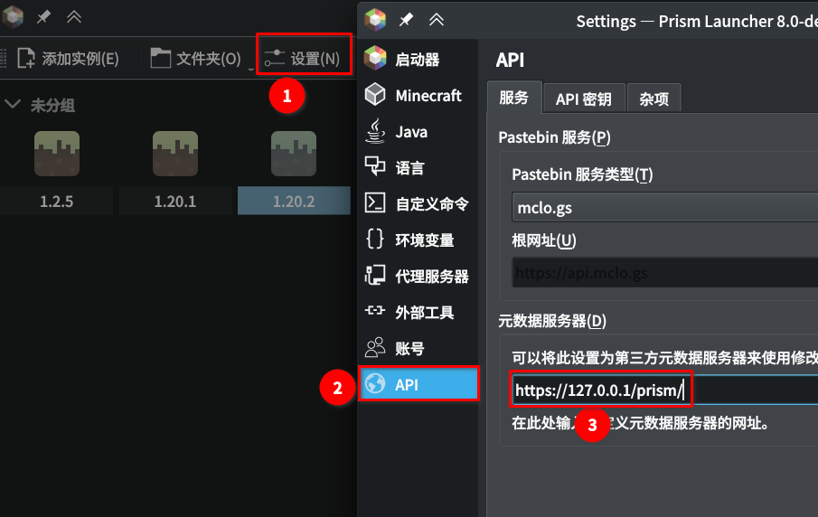

用于将Prismlauncher替换为使用BMCLAPI源的nginx site配置文件.  
本配置文件通过使用nginx的http_sub_module模块,将原metadata源中的官方下载源替换为BMCLAPI的对应版本,同步后无需额外操作即可直接使用.  

### 部署方法: 
- 将此仓库克隆到本地, 并设置定期同步以更新上游: `https://github.com/PrismLauncher/meta-launcher.git`  
- Prismlauncher只支持https的meta源, 因此需要准备ssl证书. 可以使用自签证书, 如用自签证书则需要在需使用该源的设备上安装并信任该证书.  
- 安装Nginx web服务端. 编译时需要启用http_sub_module模块.  
- 将prism.conf配置文件中的三个路径设置好, 然后放入`/etc/nginx/sites-enabled/`文件夹. (如在Windows机器上部署,则换成对应路径)  

### Prismlauncher设置:

### 局限性:
- 原版的Assets资源文件不走镜像源, 而是仍然从官方源下载.
